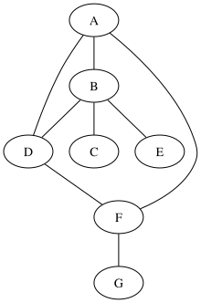
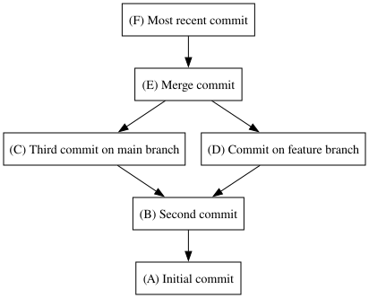
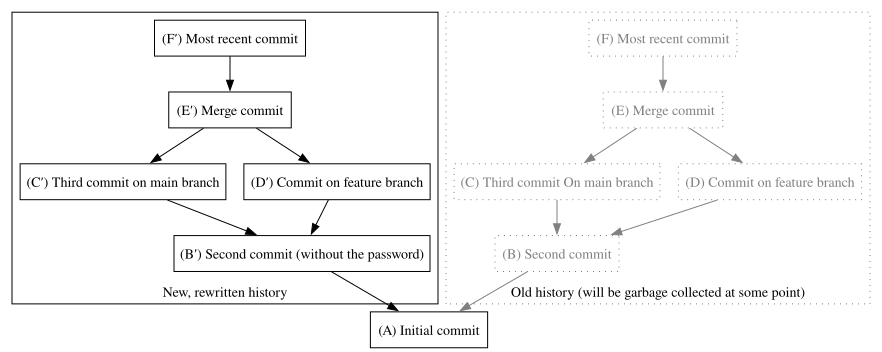

What makes a commit?

A tree object, 
Zero, one or more parents;
An author identity (name and email), and a timestamp;
A committer identity (name and email), and a timestamp;
An optional PGP signature
A message;

All hashed together in a unique SHA-1 identifier

The git history is a Merkle DAG
The data structure that holds commit history is a graph, series of nodes (commit objects) connected with edges.

GIT commit graph has extra properties:
Edges have direction -> child to parent (directed)
Does not have cycles, you can start at any commit and walk to its parent, it will always arrive at root commit, acyclic

ALTHOUGH TIME FLOWS BOTTOM TO TOP (MOST RECENT COMMIT AT THE TOP, ARROWS GO FROM TOP TO BOTTOM TO EACH COMMIT'S ANCESTORS)
commits point to parents

Diamond merge

Unlike regular graphs, the parents of a node are part of that commit's identity => commit notes are not called A,B,C but it's a crypto hash of its contents, and those contents include the name of its parent(s)

the name of an object is not something we decide arbitrarily, but the result of applying the SHA-1 function to that object, which gives names like 6db691fb5486e8f9653e3a63880c9b23885bdfd8. Those names are thus, in a way, not something we decide but something we discover.

The fact that nodes (commits) are labeled after their contents make the git history a structure akin to what’s called a Merkle tree. A Merkle tree is a type of graph where each node is identified by the cryptographic hash of its contents and the contents of its children, up to the terminal leaves. This means that the label of the root of the tree hashes both the structure of the tree and the contents of each node in that structure. In other words, if you append anything to a Merkle tree, you modify the identity of all its ancestors.

First, it’s not actually a tree. In computer science, a tree is a DAG whose nodes have at most one ancestor. A merge commit, in git, has as many ancestors at commits it merges; like commit E in the above example. (you may still see the name “Merkle tree” used when talking about git history; but it’s technically incorrect).

The second difference lies in the fact that in git, the hashing operations goes from the leaves to the root. In a regular Merkle tree, adding an extra commit would change the root’s identity, since the root hashes its leaves. But that would mean that adding a new commit would change the full history. What git does is the exact opposite: you can freely append new commits to an existing history without altering it, but each new commit is bound to the entire history that precedes it.

To understand how this works, let’s look at commit objects again. This is a commit, generated by the wyag test script:

tree 8a617fb80c95a1bb638911ae1162ead88282c0eb
parent b664cefa3649658a1dad03163d22cc37ddcd3b77
author wyag-tests.sh <wyag@example.com> 1262304123 +0100
committer wyag-tests.sh <wyag@example.com> 1262304123 +0100

Commit 2

As we’ve seen earlier, the identity of this object (its hash) is computed by hashing it down, along with a few extra headers, to a SHA-1 hex hash, giving us in that case 75ee472e7e7021b1639507e89da14b89bfa8987f. This means we cannot give it a different parent, or alter its tree, or change any other property of that commit without changing that hash id.

To create a new commit with this one as its parent, the new commit need simply to have a corresponding parent field:

...
parent 75ee472e7e7021b1639507e89da14b89bfa8987f
...

This is the key difference with a regular Merkle tree. Git nodes (commits) store references to their parent(s), not their children. Adding commits on top of existing commits has no effects on their ancestors.

A fundamental property of that data structure is that you cannot modify, or even move, a node, without its name changing. To put it a bit more dramatically, this means that nodes are immutable — you cannot change them or move them at all. Operations you could think of as modifying a commit, like --amend or rebasing, actually create a new commit object, and leave the old one to be garbage collected later.

This is why any change to an earlier state affects all subsequent states. In the above example diagram of a git history, say I’ve accidentally committed a secret password in the commit I’ve called B. If I try to “modify” B, I’ll create a new commit B′ with a slightly different tree (without the leaked password). Because its tree is different, B′ will have a different hash than B. For B to “become” the parent of C and D, I need to copy C and D as C′ and D′, changing their parent fields to match the hash of B′. And the same operation will repeat to create E′ at the child of C′ and D′, and so on. This is what the resulting history will look like:

Btw, this also means that the git history is intrinsically acyclic: since the identity of an object (its hash) depends recursively of the identity of each of its parents up to the root, a cycle would mean that this recursion never terminates. In more practical term, trying to create a cycle with two objects both referring to the other at its parent would require to know the hash of the other object before computing the other’s hash.

Wait, this looks like a… blockchain?

A very common use of Merkle trees is in the blockchains of so-called “cryptocurrencies”. In Bitcoin for example, the ledger is a Merkle tree. “Mining” consists in adding the new transactions to the chain (that’s the easy part) and then finding a way to pad the block with values that make the final hash start with a given number of binary ones (this is the “proof of work” that intentionally keeps the network slow and energy-consuming, in order to prevent it from diverging)

So yes, in a way, Git is a blockchain: it’s a sequence of blocks (commits) tied together by cryptographic means in a way that guarantee that each single element is associated to the whole history of the structure. Don’t take the comparison too seriously, though: we don’t need a GitCoin. Really, we don’t.

6. Reading commit data: checkout
Let’s resume working with commit objects. It’s nice to know that they hold a lot more than files and directories in a given state, but that doesn’t make them really useful. It’s probably time to start implementing tree objects as well, so we’ll be able to checkout commits into the work tree.

6.1. What’s in a tree?
Informally, a tree describes the content of the work tree, that it, it associates blobs to paths. It’s an array of three-element tuples made of a file mode, a path (relative to the worktree) and a SHA-1. A typical tree contents may look like this:

Mode	SHA-1	Path
100644	894a44cc066a027465cd26d634948d56d13af9af	.gitignore
100644	94a9ed024d3859793618152ea559a168bbcbb5e2	LICENSE
100644	bab489c4f4600a38ce6dbfd652b90383a4aa3e45	README.md
100644	6d208e47659a2a10f5f8640e0155d9276a2130a9	src
040000	e7445b03aea61ec801b20d6ab62f076208b7d097	tests
040000	d5ec863f17f3a2e92aa8f6b66ac18f7b09fd1b38	main.c
Mode is just the file’s mode, path is its location. The SHA-1 refers to either a blob or another tree object. If a blob, the path is a file, if a tree, it’s directory. To instantiate this tree in the filesystem, we would begin by loading the object associated to the first path (.gitignore) and check its type. Since it’s a blob, we’ll just create a file called .gitignore with this blob’s contents; and same for LICENSE and README.md. But the object associated with src is not a blob, but another tree: we’ll create the directory src and repeat the same operation in that directory with the new tree.

A path is a single filesystem entry

The path identifies exactly one file or directory. Not two, not three. If you have five levels of nested directories, even if four are empty save the next directory, you’re going to need five tree objects recursively referring to one another. You cannot take the shortcut of putting a full path in a single tree entry, like dir1/dir2/dir3/dir4/dir5.